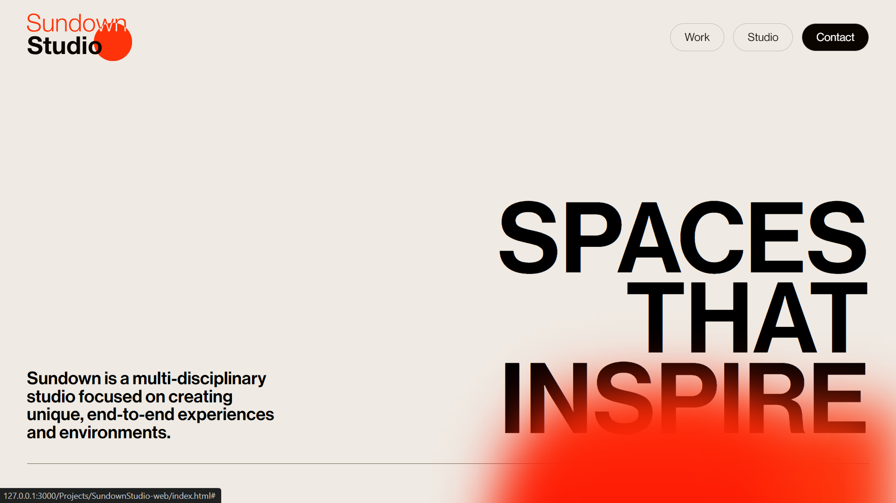

# Sundown Studio

## Overview

This project is a clone of the [Sundown Studio](https://www.sundown-studio.com/) website. The website features a modern and sleek design, highlighting the studio's portfolio and services. It uses smooth animations, and high-quality assets to create an engaging user experience.

## Pictures

### Home

### Showcase

## Basic Technologies Used

- **HTML5**: For structuring the web pages and content.
- **CSS3**: For styling and layout, including Flexbox and Grid for responsive design.
- **JavaScript**: For interactivity and dynamic content updates.
- **GSAP (GreenSock Animation Platform)**: For smooth animations and transitions.

## Additional Details

- **Smooth Scroll**: Implemented smooth scrolling for better navigation and user experience.
- **Lazy Loading**: Used lazy loading for images to improve page load times and performance.
- **SEO Optimization**: Basic SEO best practices are followed, including meta tags and alt attributes for images.
